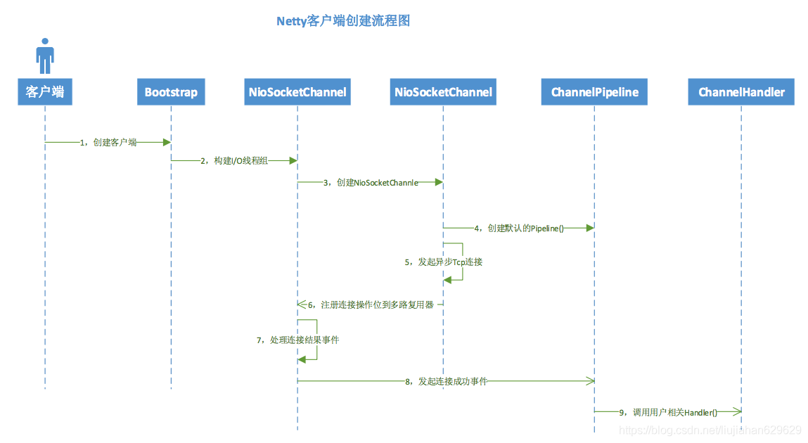
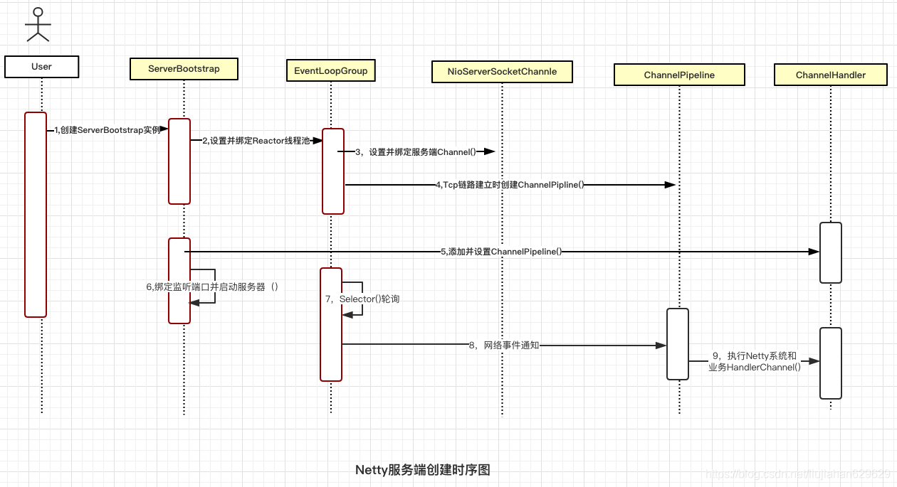
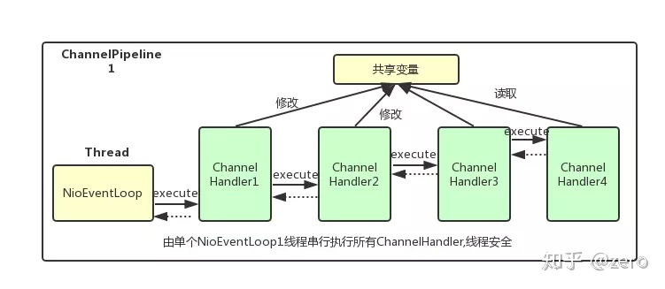
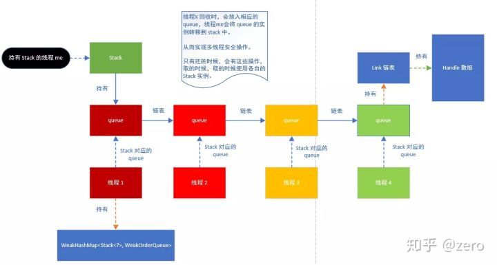
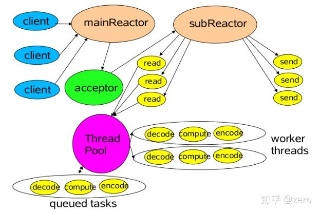

# 9 ChannelOption

 **1、ChannelOption.SO_BACKLOG**

​     ChannelOption.SO_BACKLOG对应的是**tcp/ip协议listen函数中的backlog参数**，函数listen(int socketfd,int backlog)用来初始化服务端可连接队列，服务端处理客户端连接请求是顺序处理的，所以同一时间只能处理一个客户端连接，多个客户端来的时候，服务端将不能处理的客户端连接请求放在队列中等待处理，**backlog参数指定了队列的大小**。BACKLOG用于构造服务端套接字ServerSocket对象，标识当服务器请求处理线程都处于工作是(用完了)，用于临时存放已完成三次握手的请求的队列的最大长度。如果未设置或所设置的值小于1，Java将使用默认值50

2、**ChannelOption.SO_REUSEADDR** (一般用于option–>boss)
SO_REUSEADDR 对应的是socket选项中SO_REUSEADDR，这个参数表示允许重复使用本地地址和端口，例如，某个服务占用了TCP的8080端口，其他服务再对这个端口进行监听就会报错，SO_REUSEADDR这个参数就是用来解决这个问题的，该参数允许服务公用一个端口，这个在服务器程序中比较常用，例如某个进程非正常退出，对一个端口的占用可能不会立即释放，这时候如果不设置这个参数，其他进程就不能立即使用这个端口

​      ChanneOption.SO_REUSEADDR对应于套接字选项中的**SO_REUSEADDR，这个参数表示允许重复使用本地地址和端口**，

​      比如，某个服务器进程占用了TCP的80端口进行监听，此时再次监听该端口就会返回错误，使用该参数就可以解决问题，该参数允许共用该端口，这个在服务器程序中比较常使用，

​      比如某个进程非正常退出，该程序占用的端口可能要被占用一段时间才能允许其他进程使用，而且程序死掉以后，内核一需要一定的时间才能够释放此端口，不设置SO_REUSEADDR就无法正常使用该端口。

3、ChannelOption.SO_KEEPALIVE

​      Channeloption.SO_KEEPALIVE参数对应于套接字选项中的SO_KEEPALIVE，**该参数用于设置TCP连接，当设置该选项以后，连接会测试链接的状态，这个选项用于可能长时间没有数据交流的连接。当设置该选项以后，如果在两小时内没有数据的通信时，TCP会自动发送一个活动探测数据报文**。

4、ChannelOption.SO_SNDBUF和ChannelOption.SO_RCVBUF

​      ChannelOption.SO_SNDBUF参数对应于套接字选项中的SO_SNDBUF，ChannelOption.SO_RCVBUF参数对应于套接字选项中的SO_RCVBUF这两个参数用于操作接收缓冲区和发送缓冲区的大小，接收缓冲区用于保存网络协议站内收到的数据，直到应用程序读取成功，发送缓冲区用于保存发送数据，直到发送成功。

5、ChannelOption.SO_LINGER

​      ChannelOption.SO_LINGER参数对应于套接字选项中的SO_LINGER,Linux内核默认的处理方式是当用户调用close（）方法的时候，函数返回，在可能的情况下，尽量发送数据，不一定保证会发生剩余的数据，造成了数据的不确定性，使用SO_LINGER可以阻塞close()的调用时间，直到数据完全发送

6、ChannelOption.TCP_NODELAY (一般用于childOption)
TCP_NODELAY 对应于socket选项中的TCP_NODELAY，该参数的使用和Nagle算法有关，Nagle算法是将小的数据包组装为更大的帧进行发送，而不会来一个数据包发送一次，目的是为了提高每次发送的效率，因此在数据包没有组成足够大的帧时，就会延迟该数据包的发送，虽然提高了网络负载却造成了延时，TCP_NODELAY参数设置为true，就可以禁用Nagle算法，即使用小数据包即时传输。
TCP_NODELAY就是用于启用或关闭Nagle算法。如果要求高实时性，有数据发送时就马上发送，就将该选项设置为true关闭Nagle算法；如果要减少发送次数减少网络交互，就设置为false等累积一定大小后再发送。默认为false。

​      ChannelOption.TCP_NODELAY参数对应于套接字选项中的TCP_NODELAY,该参数的使用与Nagle算法有关,**Nagle算法是将小的数据包组装为更大的帧然后进行发送，而不是输入一次发送一次,因此在数据包不足的时候会等待其他数据的到了，组装成大的数据包进行发送，虽然该方式有效提高网络的有效负载，但是却造成了延时，而该参数的作用就是禁止使用Nagle算法**，使用于小数据即时传输，于TCP_NODELAY相对应的是TCP_CORK，该选项是需要等到发送的数据量最大的时候，一次性发送数据，适用于文件传输。

7、IP_TOS

IP参数，设置**IP头部的Type-of-Service字段，用于描述IP包的优先级和QoS选项**。

8、ALLOW_HALF_CLOSURE

Netty参数，一个连接的远端关闭时本地端是否关闭，默认值为False。值为False时，连接自动关闭；**为True时，触发ChannelInboundHandler的userEventTriggered()方法，事件为ChannelInputShutdownEvent**。

9 。

10 **ChannelOption.ALLOCATOR**
Netty参数，ByteBuf的分配器(重用缓冲区)，默认值为ByteBufAllocator.DEFAULT，4.0版本为UnpooledByteBufAllocator，4.1版本为PooledByteBufAllocator。该值也可以使用系统参数io.netty.allocator.type配置，使用字符串值：“unpooled”，“pooled”。
额外解释， Netty4.1使用对象池，重用缓冲区(可以直接只用这个配置)
bootstrap.option(ChannelOption.ALLOCATOR, PooledByteBufAllocator.DEFAULT);
bootstrap.childOption(ChannelOption.ALLOCATOR, PooledByteBufAllocator.DEFAULT);

11 ChannelOption.RCVBUF_ALLOCATOR** （一般用于option->boss）
Netty参数，用于Channel分配接受Buffer的分配器，默认值为AdaptiveRecvByteBufAllocator.DEFAULT，是一个自适应的接受缓冲区分配器，能根据接受到的数据自动调节大小。可选值为FixedRecvByteBufAllocator，固定大小的接受缓冲区分配器。

12 **ChannelOption.SO_SNDBUF 和ChannelOption.SO_RCVBUF** (一般用于childOption)
SO_SNDBUF 和 SO_RCVBUF对应socket中的SO_SNDBUF和SO_RCVBUF参数，即设置发送缓冲区和接收缓冲区的大小，***发送缓冲区用于保存发送数据，直到发送成功***，接收缓冲区用于保存网络协议站内收到的数据，直到程序读取成功。
**或者**
**SO_RCVBUF参数**，TCP数据接收缓冲区大小。该缓冲区即TCP接收滑动窗口，linux操作系统可使用命令：cat /proc/sys/net/ipv4/tcp_rmem查询其大小。一般情况下，该值可由用户在任意时刻设置，但当设置值超过64KB时，需要在连接到远端之前设置。
**SO_SNDBUF参数**，TCP数据发送缓冲区大小。该缓冲区即TCP发送滑动窗口，linux操作系统可使用命令：cat /proc/sys/net/ipv4/tcp_smem查询其大小。

13 ChannelOption.CONNECT_TIMEOUT_MILLIS**： (一般用于Bootstrap或者childOption)
Netty参数，连接超时毫秒数，默认值30000毫秒即30秒。

- **ChannelOption.SO_LINGER** (一般用于childOption)
  Socket参数，关闭Socket的延迟时间，默认值为-1，表示禁用该功能。-1表示socket.close()方法立即返回，但OS底层会将发送缓冲区全部发送到对端。0表示socket.close()方法立即返回，OS放弃发送缓冲区的数据直接向对端发送RST包，对端收到复位错误。非0整数值表示调用socket.close()方法的线程被阻塞直到延迟时间到或发送缓冲区中的数据发送完毕，若超时，则对端会收到复位错误。
- **ChannelOption.SO_KEEPALIVE**
    Socket参数，连接保活，默认值为False。启用该功能时，TCP会主动探测空闲连接的有效性。可以将此功能视为TCP的心跳机制，需要注意的是：默认的心跳间隔是7200s即2小时。Netty默认关闭该功能。
- **ChannelOption.WRITE_BUFFER_HIGH_WATER_MARK** (一般用于childOption)
    Netty参数，写高水位标记，默认值64KB。如果Netty的写缓冲区中的字节超过该值，Channel的isWritable()返回False。
- **ChannelOption.WRITE_BUFFER_LOW_WATER_MARK** (一般用于childOption)
    Netty参数，写低水位标记，默认值32KB。当Netty的写缓冲区中的字节超过高水位之后若下降到低水位，则Channel的isWritable()返回True。写高低水位标记使用户可以控制写入数据速度，从而实现流量控制。推荐做法是：每次调用channl.write(msg)方法首先调用channel.isWritable()判断是否可写。
- **ChannelOption.AUTO_READ** (一般用于childOption)
    Netty参数，自动读取，默认值为True。Netty只在必要的时候才设置关心相应的I/O事件。对于读操作，需要调用channel.read()设置关心的I/O事件为OP_READ，这样若有数据到达才能读取以供用户处理。该值为True时，每次读操作完毕后会自动调用channel.read()，从而有数据到达便能读取；否则，需要用户手动调用channel.read()。需要注意的是：当调用config.setAutoRead(boolean)方法时，如果状态由false变为true，将会调用channel.read()方法读取数据；由true变为false，将调用config.autoReadCleared()方法终止数据读取。
- **ChannelOption.MAX_MESSAGES_PER_READ**
    Netty参数，一次Loop读取的最大消息数，对于ServerChannel或者NioByteChannel，默认值为16，其他Channel默认值为1。默认值这样设置，是因为：ServerChannel需要接受足够多的连接，保证大吞吐量，NioByteChannel可以减少不必要的系统调用select。
- **ChannelOption.WRITE_SPIN_COUNT**
    Netty参数，一个Loop写操作执行的最大次数，默认值为16。也就是说，对于大数据量的写操作至多进行16次，如果16次仍没有全部写完数据，此时会提交一个新的写任务给EventLoop，任务将在下次调度继续执行。这样，其他的写请求才能被响应不会因为单个大数据量写请求而耽误。
- **ChannelOption.MESSAGE_SIZE_ESTIMATOR**
    Netty参数，消息大小估算器，默认为DefaultMessageSizeEstimator.DEFAULT。估算ByteBuf、ByteBufHolder和FileRegion的大小，其中ByteBuf和ByteBufHolder为实际大小，FileRegion估算值为0。该值估算的字节数在计算水位时使用，FileRegion为0可知FileRegion不影响高低水位
- **ChannelOption.SINGLE_EVENTEXECUTOR_PER_GROUP**
    Netty参数，单线程执行ChannelPipeline中的事件，**默认值为True**。该值控制执行ChannelPipeline中执行ChannelHandler的线程。如果为True，**整个pipeline由一个线程执行**，这样不需要进行线程切换以及线程同步，**是Netty4的推荐做法**；如果为False，ChannelHandler中的处理过程会由Group中的不同线程执行

# 10 netty支持的各种socketchannel

- OioSocketChannel：传统，阻塞式编程。
- NioSocketChannel：select/poll或者epoll，jdk 7之后linux下会自动选择epoll。
- EpollSocketChannel：epoll，仅限linux，提供更多额外选项。
- EpollDomainSocketChannel：ipc模式，仅限客户端、服务端在相同主机的情况，从4.0.26版本开始支持

# 11、Netty跟Java NIO优势？

java nio缺点:

1.NIO API繁杂

2.具备其他而外技能，熟悉java多线程编程。

3.可靠性能力补齐，工作量和难度很大，如网络断链，半包，缓存失败。

4.JDK NIO的BUg，如epoll bug。

netty优点：

1.API 使用简单

2.功能强大

3定制能力强

4 性能高

5 成熟稳定

6 社区活跃

7 经历的大规模的商业应用考验。

# 12、Netty组件有哪些，分别有什么关联？

**Netty应用中必不可少的组件：**

-  Bootstrap or ServerBootstrap
-  EventLoop
-  EventLoopGroup
-  ChannelPipeline
-  Channel
-  Future or ChannelFuture
-  ChannelInitializer
-  ChannelHandler

**1.Bootstrap**

一个Netty应用通常由一个Bootstrap开始，它主要作用是配置整个Netty程序，串联起各个组件。

Handler，为了支持各种协议和处理数据的方式，便诞生了Handler组件。Handler主要用来处理各种事件，这里的事件很广泛，比如可以是连接、数据接收、异常、数据转换等。

**2.ChannelInboundHandler**

一个最常用的Handler。这个Handler的作用就是处理接收到数据时的事件，也就是说，我们的业务逻辑一般就是写在这个Handler里面的，ChannelInboundHandler就是用来处理我们的核心业务逻辑。

**3.ChannelInitializer**

当一个链接建立时，我们需要知道怎么来接收或者发送数据，当然，我们有各种各样的Handler实现来处理它，那么ChannelInitializer便是用来配置这些Handler，它会提供一个ChannelPipeline，并把Handler加入到ChannelPipeline。

**4.ChannelPipeline**

一个Netty应用基于ChannelPipeline机制，这种机制需要依赖于EventLoop和EventLoopGroup，因为它们三个都和事件或者事件处理相关。

EventLoops的目的是为Channel处理IO操作，一个EventLoop可以为多个Channel服务。

EventLoopGroup会包含多个EventLoop。

**5.Channel**

代表了一个Socket链接，或者其它和IO操作相关的组件，它和EventLoop一起用来参与IO处理。

**6.Future**

在Netty中所有的IO操作都是异步的，因此，你不能立刻得知消息是否被正确处理，但是我们可以过一会等它执行完成或者直接注册一个监听，具体的实现就是通过Future和ChannelFutures,他们可以注册一个监听，当操作执行成功或失败时监听会自动触发。

总之，所有的操作都会返回一个ChannelFuture。

 https://blog.csdn.net/summerZBH123/article/details/79344226 

# 13、Netty的客户端和服务端？

# 13.1 客户端启动流程

https://blog.csdn.net/luzhensmart/article/details/108308018

  

1，用户创建Bootstrap实例，通过API设置创建客户端相关的参数，异步发起客户端连接；

2，创建客户端连接、I/O读写的Reactor线程组NioEventLoopGroup，可以通过构造函数指定I/O线程的个数，默认为CPU内核的2倍；

3，通过Bootstrap的ChannelFactory和用户指定的Channel类型创建用于客户端连接的NioSocketChannel；

4，创建默认的Channel Handler Pipeline用于调度和执行网络事件；

5，异步发起TCP连接，判断连接是否成功，如果成功直接将NioSocketChannel注册到多路复用器上，监听读操作位，如果没有没连接成功，则注册连接监听位到多路复用器，等待连接结果；

6，注册对应的网络监听状态位到多路复用器；

7，由多路复用器在I/O中轮询各Channel，处理连接结果；

8，如果连接成功，设置Future结果，发送连接成功事件，触发ChannelPipeline执行；

9，由ChannelPipeline调度执行系统和用户的ChannelHandler，执行业务逻辑。

​    看完流程后，接下来，我们看看源码吧。Bootstrap是外观模式的外观类，我们先来看看它。

# 13.2 服务端启动流程

  

 1 创建ServerBootstrap实例：ServerBootstrap是Netty服务端的启动辅助类，它提供了一系列的方法用于设置服务端启动相关参数，这里用到了Faced设计模式（降低和过多底层API打交道）；另外ServerBootstrap在创建时，是无参的，只需要后边设置对应的参数即可，这边其实是用到了Builder设计模式（只需要关心多个简单的对象构建，不需要关心对象创建的内部细节）。类名：ServerBootstrap

 2 设置并绑定Reactor线程池：b.group(bossGroup,workerGroup)，Netty的Reactor线程池是EventLoopGroup，EventLoop的数组。EventLoop的职责是处理所有注册到本线程多路复用器Selector上的channel，Selector的轮询操作由绑定的EventLoop线程run方法启动。EventLoop的职责不仅仅是处理网络I/O事件，还包括用户自定义的task等，都在一个线程内进行完成。类名：NioEventLoop

3，设定并绑定服务端Channel，b.channel(NioServerSocketChannel.class)，Netty通过工厂类，利用反射创建NioServerSocketChannel对象。类名：AbstractBootstrap、ReflectiveChannelFactory

4，链路建立时创建并初始化ChannelPipeple。ChannelPipeple本质是一个负责处理网络事件的职责链，负责管理和执行ChannelHadnler，网络事件以流的形式在ChannelPipeline中流转，根据执行策略调度ChannelHandler执行。典型的网络事件有：1，链路注册；2，链路激活；3，链路断开；4，接收到请求消息；5，请求消息接收并处理完毕；6，发送应答消息；7，链路发生异常处理；8，发生用户自定义事件等。类名：ChannelInitializer

5，设置ChannelPipeple，添加ChannelHandler：ch.pipeline().addLast("http-decoder",newHttpRequestDecoder());。ChannelHandler是Netty提供给用户定制和扩展的关键接口，我们可以通过ChannleHandler完成大多数的功能定制。例如：消息编解码、心跳、安全认真、TSL/SSL认证、流量控制等。同时Netty也提供了大量的系统ChannelHandler供用户使用，例如：1，系统编解码框架——ByteToMessageCodec；2，通用基于长度和半包解码器——LengthFieldBasedFrameDecoder；3，码流日志打印Handler——LoggingHandler；4，SSL安全认证Handler——SslHandler；5，链路空闲检测Handler——IdleStateHandler；5，流量整形Handler——ChannelTrafficShapingHandler；6，Base64编解码——Base64Decoder和Base64Encoder等。类名：ChannelPipeple，里边有我们先要的各种设置方法。

6，绑定启动监听端口（ChannelFuturefuture=b.bind("localhost",port).sync();），在类中：AbstractBootstrap。

7，Selector轮询，由Reactor线程NioEventLoop负责调度和执行Selector轮询操作。类NioEventLoop中的private void select(boolean oldWakenUp) throws IOException{}。

8，当轮询到准备就绪的Channel之后，就由Reactor线程NioEventLoop执行ChannelPipeline的相应方法，最终调度并执行ChannelHandler。类：ChannelPipeline

9，执行Netty系统ChannelHandler和用户添加开发的ChannelHandler，ChannelPipeline根据网络事件类型，调度并执行。AbstractChannelHandlerContext中的fireChannelRead()。

 

   好，上边说的是Server创建并提供服务的整个流程，接下来，我们来看下，客户端接入的过程：

   当有新的客户端连接接入时，多路服务器检测到新的准备就绪的Channel时，NioEventLoop执行processSelectedKeys方法中的processSelectedKeysOptimized(selectedKeys.flip());进入到processSelectedKeysOptimized方法中，由于Channel的Attachment是NioServerSocketChannel，所以执行processSelectedKey(k,(AbstractNioChannel)a)方法，由于是监听的连接操作，执行unsafe.read()，read()方法的实现由两个，分别为NioByteUnsafe和NioMessageUnsafe,对于NioServerSocketChannel，它使用的NioMessageUnsafe，可以看下代码，里边的int localRead=doReadMessages(readBuf)，进入了NioServerSocketChannel的doReadMessage(List<Object> buf)，里边Socket Channelch=javaChannel().accept();创建NioSocketChannel并接受，然后再触发ChannelPipeline的ChannelRead方法，在ChannelPipeline中传递，并执行操作。

# 14、Netty高性能体现在哪些方面？

# 15、Netty的线程模型是怎么样的？

# 16、Netty的零拷贝提体现在哪里，与操作系统上的有什么区别？

# 17、Netty的内存池是怎么实现的？

# 18、Netty的对象池是怎么实现的？

# 19、在实际项目中，你们是怎么使用Netty的？

# 20、使用过Netty遇到过什么问题？

(1)创建两个NioEventLoopGroup,用于逻辑隔离NIO Acceptor和NIO I/O线程

(2)尽量不要在ChannelHandler中启动用户线程(解码后用于将POJO消息派发到后端业务线程的除外)

(3)解码要放在NIO线程调用的解码Handler中进行,不要切换到用户线程完成消息的解码.

(4)如果业务逻辑操作非常简单(纯内存操作),没有复杂的业务逻辑计算,也可能会导致线程被阻塞的磁盘操作,数据库操作,网络操作等,可以直接在NIO线程上完成业务逻辑编排,不需要切换到用户线程.

(5)如果业务逻辑复杂,不要在NIO线程上完成,建议将解码后的POJO消息封装成任务,派发到业务线程池中由业务线程执行,以保证NIO线程尽快释放,处理其它I/O操作.

(6)可能导致阻塞的操作,数据库操作,第三方服务调用,中间件服务调用,同步获取锁,Sleep等

(7)Sharable注解的ChannelHandler要慎用

(8)避免将ChannelHandler加入到不同的ChannelPipeline中,会出现并发问题.

从上面的随便挑一个吹水就行。

# 21 为什么出现半包问题

1.应用程序写入的字节大于等于套接字接口发送缓存区的大小

2.进行MSS大小的TCP分段

3.以太帧的payload大于MTU进行IP分配。

# 22 解决jdk NIO的bug

1、[selector.select](https://link.zhihu.com/?target=http%3A//selector.select)(timeoutMillis)，调用了select方法，并默认设置1秒超时时间，同时记录轮询次数：selectCnt ++;

2、获取当前时间，计算select方法的操作时间是否真的阻塞了timeoutMillis，如果是就证明是一次正常的select()，重置selectCnt = 1;如果不是，就可能触发了JDK的空轮询BUG，然后判断selectCnt 轮询次数是否大于默认的512，然后进行rebuildSelector()。

3、rebuildSelector()方法重新打开一个Selector；然后遍历oldSelector，将所有的key重新注册到新的Selector；然后重新赋值selector，selectCnt = 1;这时候已经规避了空轮询。

4 释放老的Selector

# 23 了解哪几种序列化协议？

- 序列化（编码）是将对象序列化为二进制形式（字节数组），主要用于网络传输、数据持久化等；而反序列化（解码）则是将从网络、磁盘等读取的字节数组还原成原始对象，主要用于网络传输对象的解码，以便完成远程调用。
- 影响序列化性能的关键因素：序列化后的码流大小（网络带宽的占用）、序列化的性能（CPU资源占用）；是否支持跨语言（异构系统的对接和开发语言切换）。
- Java默认提供的序列化：无法跨语言、序列化后的码流太大、序列化的性能差
- XML，优点：人机可读性好，可指定元素或特性的名称。缺点：序列化数据只包含数据本身以及类的结构，不包括类型标识和程序集信息；只能序列化公共属性和字段；不能序列化方法；文件庞大，文件格式复杂，传输占带宽。适用场景：当做配置文件存储数据，实时数据转换。
- JSON，是一种轻量级的数据交换格式，优点：兼容性高、数据格式比较简单，易于读写、序列化后数据较小，可扩展性好，兼容性好、与XML相比，其协议比较简单，解析速度比较快。缺点：数据的描述性比XML差、不适合性能要求为ms级别的情况、额外空间开销比较大。适用场景（可替代ＸＭＬ）：跨防火墙访问、可调式性要求高、基于Web browser的Ajax请求、传输数据量相对小，实时性要求相对低（例如秒级别）的服务。
- Fastjson，采用一种“假定有序快速匹配”的算法。优点：接口简单易用、目前java语言中最快的json库。缺点：过于注重快，而偏离了“标准”及功能性、代码质量不高，文档不全。适用场景：协议交互、Web输出、Android客户端
- Thrift，不仅是序列化协议，还是一个RPC框架。优点：序列化后的体积小, 速度快、支持多种语言和丰富的数据类型、对于数据字段的增删具有较强的兼容性、支持二进制压缩编码。缺点：使用者较少、跨防火墙访问时，不安全、不具有可读性，调试代码时相对困难、不能与其他传输层协议共同使用（例如HTTP）、无法支持向持久层直接读写数据，即不适合做数据持久化序列化协议。适用场景：分布式系统的RPC解决方案
- Avro，Hadoop的一个子项目，解决了JSON的冗长和没有IDL的问题。优点：支持丰富的数据类型、简单的动态语言结合功能、具有自我描述属性、提高了数据解析速度、快速可压缩的二进制数据形式、可以实现远程过程调用RPC、支持跨编程语言实现。缺点：对于习惯于静态类型语言的用户不直观。适用场景：在Hadoop中做Hive、Pig和MapReduce的持久化数据格式。
- Protobuf，将数据结构以.proto文件进行描述，通过代码生成工具可以生成对应数据结构的POJO对象和Protobuf相关的方法和属性。优点：序列化后码流小，性能高、结构化数据存储格式（XML JSON等）、通过标识字段的顺序，可以实现协议的前向兼容、结构化的文档更容易管理和维护。缺点：需要依赖于工具生成代码、支持的语言相对较少，官方只支持Java 、C++ 、python。适用场景：对性能要求高的RPC调用、具有良好的跨防火墙的访问属性、适合应用层对象的持久化

 https://blog.csdn.net/jiao1902676909/article/details/90647497 

 https://baijiahao.baidu.com/s?id=1669639041722396699&wfr=spider&for=pc 

# 24  Netty和Tomcat的区别?

作用不同：Tomcat 是 Servlet 容器，可以视为 Web 服务器，而 Netty 是异步事件驱动的网络应用程序框架和工具用于简化网络编程，例如TCP和UDP套接字服务器。

协议不同：Tomcat 是基于 http 协议的 Web 服务器，而 Netty 能通过编程自定义各种协议，因为 Netty 本身自己能编码/解码字节流，所有 Netty 可以实现，HTTP 服务器、FTP 服务器、UDP 服务器、RPC 服务器、WebSocket 服务器、Redis 的 Proxy 服务器、MySQL 的 Proxy 服务器等等。

# 25  Netty发送消息有几种方式? 

- Netty 有两种发送消息的方式：

  直接写入 Channel 中，消息从 ChannelPipeline 当中尾部开始移动；

  写入和 ChannelHandler 绑定的 ChannelHandlerContext 中，消息从 ChannelPipeline 中的下一个 ChannelHandler 中移动
  

# 26  Netty支持哪些心跳类型设置? 

- readerIdleTime：为读超时时间（即测试端一定时间内未接受到被测试端消息）。
- writerIdleTime：为写超时时间（即测试端一定时间内向被测试端发送消息）。
- allIdleTime：所有类型的超时时间。

# 28  Dubbo 在使用 Netty 作为网络通讯时候是如何避免粘包与半包问题 

  https://www.wandouip.com/t5i135072/ 

 https://blog.csdn.net/zh_ka/article/details/84735879 

 # 29、如何使用包定长 FixedLengthFrameDecoder 解决粘包与半包问题？原理是什么？

# 30、如何使用包分隔符 DelimiterBasedFrameDecoder 解决粘包与半包问题？原理是什么？ 

**Netty的对象池是怎么实现的？**

Netty 并没有使用第三方库实现对象池，而是自己实现了一个相对轻量的对象池。通过使用 threadLocal，避免了多线程下取数据时可能出现的线程安全问题，同时，为了实现多线程回收同一个实例，让每个线程对应一个队列，队列链接在 Stack 对象上形成链表，这样，就解决了多线程回收时的安全问题。同时，使用了软引用的map 和 软引用的 thradl 也避免了内存泄漏。

更详细的可阅读文章：

[https://www.jianshu.com/p/83469191509b](https://link.zhihu.com/?target=https%3A//www.jianshu.com/p/83469191509b)
[https://www.cnblogs.com/hzmark/p/netty-object-pool.html](https://link.zhihu.com/?target=https%3A//www.cnblogs.com/hzmark/p/netty-object-pool.html)

# 31、netty的线程模型，netty如何基于reactor模型上实现的

这个网上很多了，就不说了。
[https://www.cnblogs.com/coding400/p/10865333.html](https://link.zhihu.com/?target=https%3A//www.cnblogs.com/coding400/p/10865333.html)

# 33、netty的fashwheeltimer的用法，实现原理，是否出现过调用不够准时，怎么解决。**

[https://www.cnblogs.com/eryuan/p/7955677.html](https://link.zhihu.com/?target=https%3A//www.cnblogs.com/eryuan/p/7955677.html)

# 34、netty的心跳处理在弱网下怎么办。

[https://blog.csdn.net/z69183787/article/details/52671543](https://link.zhihu.com/?target=https%3A//blog.csdn.net/z69183787/article/details/52671543)

# 35、netty的通讯协议是什么样的。

[https://www.cnblogs.com/549294286/p/11241357.html](https://link.zhihu.com/?target=https%3A//www.cnblogs.com/549294286/p/11241357.html)

# 36 启动线程的个数

 Netty 默认是 CPU 处理器数的两倍，bind 完之后启动。 

# 37 为什么Netty使用NIO而不是AIO？

1 Netty不看重Windows上的使用，在Linux系统上，AIO的底层实现仍使用EPOLL，没有很好实现AIO，因此在性能上没有明显的优势，而且被JDK封装了一层不容易深度优化

2 Netty整体架构是reactor模型, 而AIO是proactor模型, 混合在一起会非常混乱,把AIO也改造成reactor模型看起来是把epoll绕个弯又绕回来

3 AIO还有个缺点是接收数据需要预先分配缓存, 而不是NIO那种需要接收时才需要分配缓存, 所以对连接数量非常大但流量小的情况, 内存浪费很多

4 Linux上AIO不够成熟，处理回调结果速度跟不到处理需求，比如外卖员太少，顾客太多，供不应求，造成处理速度有瓶颈（待验证）

# 38 Netty为何高效？

I/O通讯性能三原则：

1.传输

2.协议

3.线程：基于reactor

Netty高性能表现在哪些方面：

1.异步非阻塞通讯

NioLoop聚合了多路复用器selector，非阻塞的，netty采用了异步通讯模式，一个I/0线程可以并发处理N个客户端的连接和读写。

2.高效的reactor线程模型

单线程模型，多线程模型，主从Reator多线程模型

3.无锁化的串行设计

4 高效的并发编程 volatitle cas 原子类实现，读写锁

5.高效的序列化框架

6 零拷贝

1）netty采用的bytebuffer 采用直接内存，无需像传统的jvm堆内存拷贝一份。

2）CoppositeByeBuf 将多规格ByteBuf封装成一个ByteBuf添加ByteBuf不需要内存拷贝

3）文件传输，netty的文件传输类DefaltFileRegion通过transferTo将文件直接发送到目标Channel中

7 内存池

8灵活的TCP参数配置能力，合理设置S0_RCVBUF和SO——SNDBUF的设置可以提升性能提升。

# 39 ChannelFuture

# 40 

