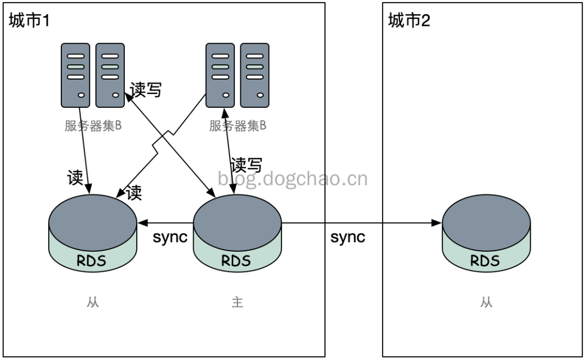
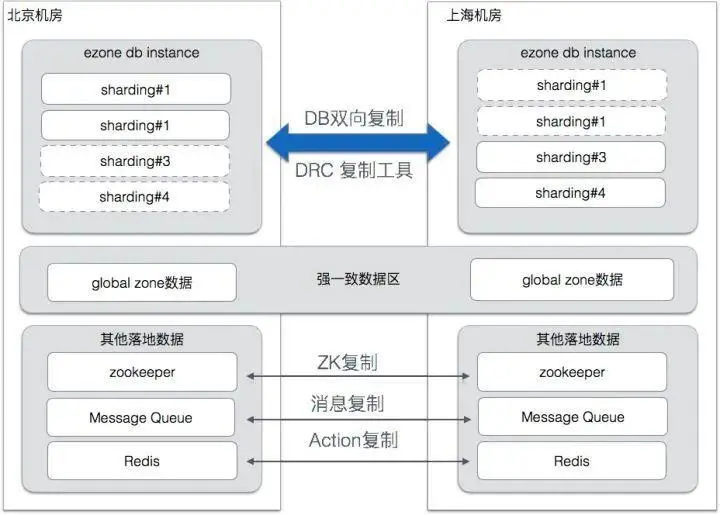
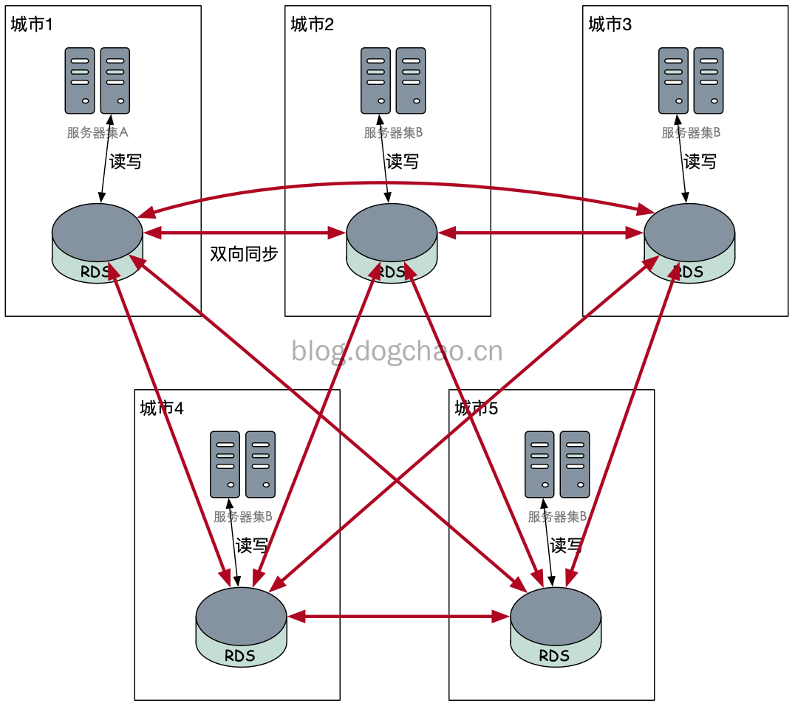
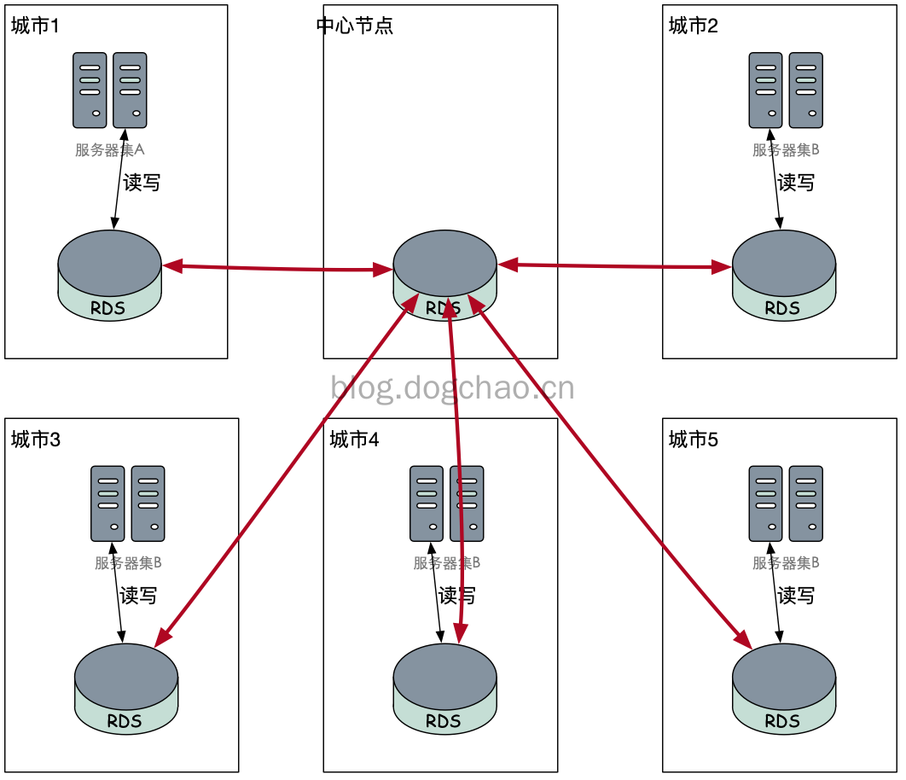
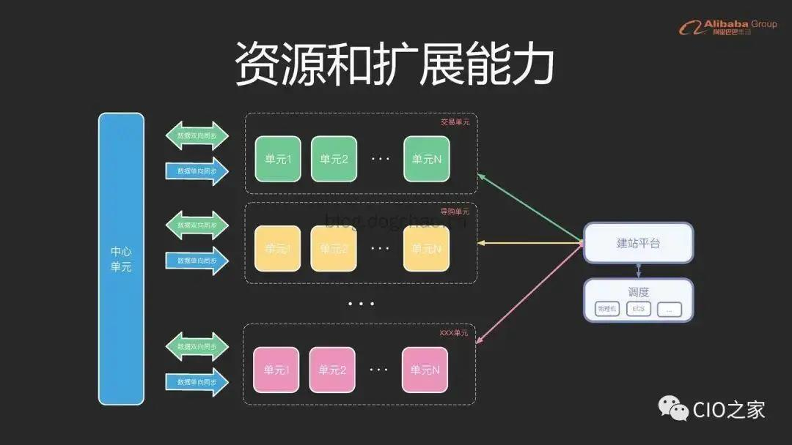

# mysql HA集群设计

# 0 高可用的一些解决方案

高可用，从发展来看，大致经过了这几个过程：

1 冷备

2 双机热备

3 同城双活

4 异地双活

5 异地多活

# 1 冷备

冷备，通过停止数据库对外服务的能力，通过文件拷贝的方式将数据快速进行备份归档的操作方式。简而言之，冷备，就是复制粘贴，在linux上通过`cp`命令就可以很快完成。可以通过人为操作，或者定时脚本进行。有如下好处：

- 简单
- 快速备份（相对于其他备份方式）
- 快速恢复。只需要将备份文件拷贝回工作目录即完成恢复过程（亦或者修改数据库的配置，直接将备份的目录修改为数据库工作目录）。更甚，通过两次`mv`命令就可瞬间完成恢复。
- 可以按照时间点恢复。比如，几天前发生的拼多多优惠券漏洞被人刷掉很多钱，可以根据前一个时间点进行还原，“挽回损失”。

以上的好处，对于以前的软件来说，是很好的方式。但是对于现如今的很多场景，已经不好用了，因为：

1 **服务需要停机**。**n个9肯定无法做到了。然后，以前我们的停机冷备是在凌晨没有人使用的时候进行，但是现在很多的互联网应用已经是面向全球了，所以，任何时候都是有人在使用的**。

2 **数据丢失**。如果不采取措施，那么在完成了数据恢复后，备份时间点到还原时间内的数据会丢失。传统的做法，是冷备还原以后，通过数据库日志手动恢复数据。比如通过redo日志，更甚者，我还曾经通过业务日志去手动回放请求恢复数据。恢复是极大的体力活，错误率高，恢复时间长。

3 **冷备是全量备份**。全量备份会造成磁盘空间浪费，以及容量不足的问题，只能通过将备份拷贝到其他移动设备上解决。所以，整个备份过程的时间其实更长了。想象一下每天拷贝几个T的数据到移动硬盘上，需要多少移动硬盘和时间。并且，全量备份是无法定制化的，比如只备份某一些表，是无法做到的。

如何权衡冷备的利弊，是每个业务需要考虑的。

# 2 双机热备

热备，和冷备比起来，主要的差别是不用停机，一边备份一边提供服务。**但还原的时候还是需要停机的**。由于我们讨论的是和存储相关的，所以不将共享磁盘的方式看作双机热备。

##### Active/Standby模式

相当于1主1从，主节点对外提供服务，从节点作为backup。通过一些手段将数据从主节点同步到从节点，当故障发生时，将从节点设置为工作节点。数据同步的方式可以是偏软件层面，也可以是偏硬件层面的。

偏软件层面的，比如mysql的master/slave方式，通过同步binlog的方式；sqlserver的订阅复制方式。

偏硬件层面，通过扇区和磁盘的拦截等镜像技术，将数据拷贝到另外的磁盘。偏硬件的方式，也被叫做数据级灾备；偏软件的，被叫做应用级灾备。后文谈得更多的是应用级灾备。

##### 双机互备

本质上还是Active/Standby，只是互为主从而已。双机互备并不能工作于同一个业务，只是在服务器角度来看，更好的压榨了可用的资源。比如，两个业务分别有库A和B，通过两个机器P和Q进行部署。那么对于A业务，P主Q从，对于B业务，Q主P从。整体上看起来是两个机器互为主备。这种架构下，读写分离是很好的，单写多读，减少冲突又提高了效率。

其他的高可用方案还可以参考各类数据库的多种部署模式，比如mysql的主从、双主多从、MHA；redis的主从，哨兵，cluster等等。

# 3 同城双活

前面讲到的几种方案，基本都是在一个局域网内进行的。业务发展到后面，有了同城多活的方案。和前面比起来，不信任的粒度从机器转为了机房。这种方案可以解决某个IDC机房整体挂掉的情况（停电，断网等）。

**同城双活其实和前文提到的双机热备没有本质的区别，只是“距离”更远了**，基本上还是一样（同城专线网速还是很快的）。**双机热备提供了灾备能力，双机互备避免了过多的资源浪费**。

在程序代码的辅助下，有的业务还可以做到**真正的双活，即同一个业务，双主，同时提供读写，只要处理好冲突的问题即可**。需要注意的是，并不是所有的业务都能做到。

业界更多采用的是**两地三中心的做法**。远端的备份机房能更大的提供灾备能力，能更好的抵抗地震，恐袭等情况。双活的机器必须部署到同城，距离更远的城市作为灾备机房。灾备机房是不对外提供服务的，只作为备份使用，发生故障了才切流量到灾备机房；或者是只作为数据备份。原因主要在于：**距离太远，网络延迟太大**。

如上图，用户流量通过负载均衡，将服务A的流量发送到IDC1，服务器集A；将服务B的流量发送到IDC2，服务器B；同时，服务器集a和b分别从A和B进行同城专线的数据同步，并且通过长距离的异地专线往IDC3进行同步。当任何一个IDC当机时，将所有流量切到同城的另一个IDC机房，完成了failover。当城市1发生大面积故障时，比如发生地震导致IDC1和2同时停止工作，则数据在IDC3得以保全。同时，如果负载均衡仍然有效，也可以将流量全部转发到IDC3中。不过，此时IDC3机房的距离非常远，网络延迟变得很严重，通常用户的体验的会受到严重影响的。

上图是一种基于Master-Slave模式的两地三中心示意图。城市1中的两个机房作为1主1从，异地机房作为从。也可以采用**同城双主+keepalived+vip的方式，或者MHA的方式进行failover**。但城市2不能（最好不要）被选择为Master。

# 3 异地双活

同城双活可以应对大部分的灾备情况，但是碰到大面积停电，或者自然灾害的时候，服务依然会中断。对上面的两地三中心进行改造，在异地也部署前端入口节点和应用，在**城市1停止服务后将流量切到城市2，可以在降低用户体验的情况下，进行降级。但用户的体验下降程度非常大**。

所以**大多数的互联网公司采用了异地双活**的方案。

上图是一个简单的异地双活的示意图。流量经过LB后分发到两个城市的服务器集群中，服务器集群只连接本地的数据库集群，只有当本地的所有数据库集群均不能访问，才failover到异地的数据库集群中。

在这种方式下，由于异地网络问题，双**向同步需要花费更多的时间。更长的同步时间将会导致更加严重的吞吐量下降，或者出现数据冲突的情况。吞吐量和冲突是两个对立的问题，你需要在其中进行权衡。例如，为了解决冲突，引入分布式锁/分布式事务；为了解决达到更高的吞吐量，利用中间状态、错误重试等手段，达到最终一致性；降低冲突，将数据进行恰当的sharding，尽可能在一个节点中完成整个事务**。

对于一些无法接受最终一致性的业务，饿了么采用的是下图的方式：

> 对于个别一致性要求很高的应用，我们提供了一种强一致的方案（Global Zone），**Globa Zone是一种跨机房的读写分离机制，所有的写操作被定向到一个 Master 机房进行，以保证一致性，读操作可以在每个机房的 Slave库执行，也可以 bind 到 Master 机房进行，这一切都基于我们的数据库访问层（DAL）完成，业务基本无感知。**

也就是说，在**这个区域是不能进行双活的。采用主从而不是双写，自然解决了冲突的问题**。

实际上，异地双活和异地多活已经很像了，双活的结构更为简单，所以在程序架构上不用做过多的考虑，只需要做传统的限流，failover等操作即可。但其实双活只是一个临时的步骤，最终的目的是切换到多活。因为双活除了有数据冲突上的问题意外，还**无法进行横向扩展**。

# 4 异地多活

根据异地双活的思路，我们可以画出异地多活的一种示意图。每个节点的出度和入度都是4，在这种情况下，任何节点下线都不会对业务有影响。但是，考虑到距离的问题，一次写操作将带来更大的时间开销。时间开销除了影响用户体验以外，还带来了更多的数据冲突。**在严重的数据冲突下，使用分布式锁的代价也更大。这将导致系统的复杂度上升，吞吐量下降。所以上图的方案是无法使用的**。

回忆一下我们在解决网状网络拓扑的时候是怎么优化的？引入中间节点，**将网状改为星状**：

改造为上图后，每个城市下线都不会对数据造成影响。对于原有请求城市的流量，会被**重新LoadBalance到新的节点（最好是LB到最近的城市**）。为了解决数据安全的问题，我们只需要针对中心节点进行处理即可。但是这样，对于中心城市的要求，比其他城市会更高。比如恢复速度，备份完整性等，这里暂时不展开。我们先假定中心是完全安全的。

如果我们已经将异**地多活的业务部署为上图的结构，很大程度解决了数据到处同步的问题**，不过依然会存在大量的冲突，冲突的情况可以简单认为和双活差不多。那么还有没有更好的方式呢？

回顾一下前文提到的饿了么的GlobalZone方案，总体思路就是“去分布式”，也就是说将写的业务放到一个节点的（同城）机器上。阿里是这么思考的：

实际上我猜测很多业务也是按照上图去实现的，比如滴滴打车业务这种，所有的业务都是按城市划分开的。用户、车主、目的地，他们的经纬度通常都是在同一个城市的。单个数据中心并不需要和其他数据中心进行数据交互，只有在统计出报表的时候才需要，但报表是不太注重实时性的。那么，在这种情况下，全国的业务其实可以被很好的sharding的。

但是**对于电商**这种复杂的场景和业务，按照前文说的方式进行sharding已经无法满足需求了。因为业务线非常复杂，数据依赖也非常复杂，每个数据中心相互进行数据同步的情况无可避免。淘宝的解决方式和我们切分微服务的方式有点类似：

注意看图中的数据同步箭头。以交易单元为例，**属于交易单元的业务数据，将与中心单元进行双向同步；不属于交易单元的业务数据，单向从中心单元同步。中心单元承担了最复杂的业务场景，业务单元承担了相对单一的场景。对于业务单元，可以进行弹性伸缩和容灾；对于中心单元，扩展能力较差，稳定性要求更高。可以遇见，大部分的故障都会出现在中心单元**。

按照业务进行单元切分，已经需要对代码和架构进行彻底的改造了（可能这也是为什么阿里要先从双活再切到多活，历时3年）。比如，业务拆分，依赖拆分，网状改星状，分布式事务，缓存失效等。除了对于编码的要求很高以外，对测试和运维也有非常大的挑战。如此复杂的情况，如何进行自动化覆盖，如何进行演练，如何改造流水线。这种级别的灾备，不是一般公司敢做的，投入产出也不成正比。不过还是可以把这种场景当作我们的“假想敌”，去思考我们自己的业务，未来会怎么发展，需要做到什么级别的灾备。相对而言，饿了么的多活方案可能更适合大多数的企业。

本文只是通过画图的方式进行了简单的描述，其实异地多活是需要很多很强大的基础能力的。比如，数据传输，数据校验，数据操作层（简化客户端控制写和同步的过程）等。

### 思考

文末，留几个问题大家可以思考一下：

- 假设你在做饿了么的开发，服务按照异地多活方式部署，sharding key根据省市区进行分片。假设买家在多个城市交汇的地方，比如，十字路口的四个位置分别是4个城市，那么如何处理才能让他拉到比较正常的数据？
- 你们现在的业务模块中，哪些业务是可以做多活的，哪些无法做多活？
- 所有的业务都要做多活吗？还是只需要核心业务做多活？