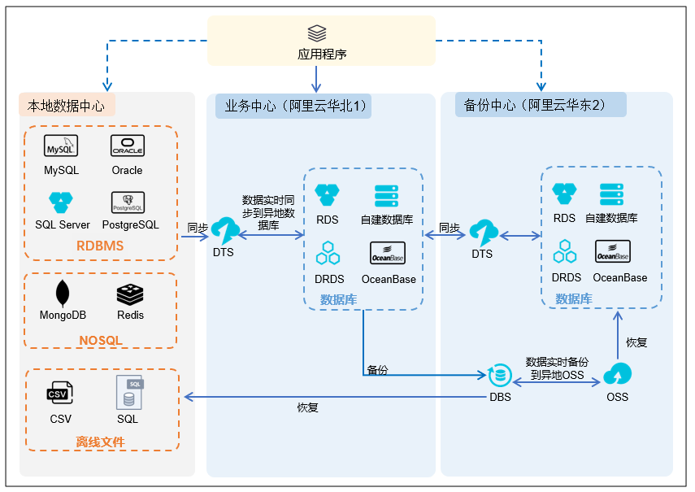

# 1 高可用原则
## 1.1 地理容灾

 SLA：服务等级协议（简称：SLA，全称：service level agreement）。
是在一定开销下为保障服务的性能和可用性。
网站服务可用性SLA，9越多代表全年服务可用时间越长服务更可靠，停机时间越短，反之亦然。
互联网公司喊口号，我们今年一定要做到3个9、4个9的含义
1年 = 365天 = 8760小时
99.9 = 8760 * 0.1% = 8760 * 0.001 = 8.76小时
99.99 = 8760 * 0.0001 = 0.876小时 = 0.876 * 60 = 52.6分钟
99.999 = 8760 * 0.00001 = 0.0876小时 = 0.0876 * 60 = 5.26分钟
从以上看来，全年停机5.26分钟才能做到99.999%，即5个9。 

**1、同城 容灾** 

同城 容灾 是在同城或相近区域内 （ ≤ 200K M ）建立两个数据中心 : 一个为数据中心，负责日常生产运行 ; 另一个为灾难备份中心，负责在灾难发生后的应用系统运行。同城灾难备份的数据中心与灾难备份中心的距离比较近，通信线路质量较好，比较容易实现数据的同步 复制 ，保证高度的数据完整性和数据零丢失。同城灾难备份一般用于防范火灾、建筑物破坏、供电故障、计算机系统及人为破坏引起的灾难。

**2、** **异地容灾**

异地 容灾 主备中心之间的距离较远 （＞ 200KM ) ， 因此一般采用异步镜像，会有少量的数据丢失。异地灾难备份不仅可以防范火灾、建筑物破坏等可能遇到的风险隐患，还能够防范战争、地震、水灾等风险。由于同城灾难备份和异地灾难备份各有所长，为达到最理想的防灾效果，数据中心应考虑采用同城和异地各建立一个灾难备份中心的方式解决

###  1.1.1 跨Region容灾（基础）

 

###  1.1.2 跨AZ容灾（基础）

跨AZ容灾指服务部件跨AZ部署，单个AZ故障，其他AZ重建或接管业务。

###  1.1.2 Pool容灾

Pool容灾值N（N>=2）位于不同的地理位置，提供相同的网络服务实体构成资源池，任意实体故障，其他池内资源实体共同分担，常用于电信软件中。

###  1.1.3 逻辑复制（基础）

数据库一般分为物理复制和逻辑复制：

1物理复制复制二进制文件

2逻辑复制复制执行sql的结果。

逻辑订阅： 1适合于发布端与订阅端都有读写的情况。

​                    2 更适合于小事务，或者低密度写（轻度写）的同步。如果有大事务、高密度写，逻辑订阅的延迟相比物理复制更高。

​                    3 适合于双向，多向同步。

物理复制 ：1适合于单向同步。

​                    2适合于任意事务，任意密度写（重度写）的同步。

​                    3 适合于HA、容灾、读写分离。

​                    4 适合于备库没有写，只有读的场景。

**云化场景中选择逻辑复制**。对于Mysql而言，逻辑复制就是抽取和应用binlog日志的过程。非同步双写的方案中，物理复制存在不一致的问题，逻辑复制可以解决不一致，回滚掉某个记录。

在容灾场景，数据库一般处于热备，要求切换时，数据库必须至少可读，物理复制就无法满足。容灾场景，数据多活、数据异构，多版本之间满足不了。结果一样即可，抽取、传输、重演。

#### 业界实现

 1 TDDL（Taobao Distributed Data Layer 框架，主要解决了分库分表对应用的透明化以及异构数据库之间的数据复制，它是一个基于集中式配置的 jdbc datasource实现，具有主备，读写分离，动态数据库配置等功能 

2 DRDS

分布式关系型数据库服务 Distributed Relational Database Service 的前身是 TDDL。它支持垂直拆分和水平拆分，因此有良好的扩展性；它通过两阶段提交支持分布式事务（此时 DRDS 服务器作为事务管理器，首先等待所有 MySQL 服务器 PREPARE 成功，然后再向各个 MySQL 服务器发送 COMMIT 请求。如果事务中的 SQL 仅涉及单个分片，DRDS 会将其作为单机事务直接下发给 MySQL；反之才会升级为分布式事务）；它允许增加 RDS 实例的数量，以达到平滑扩容的效果；它支持读写分离，强读（显式事务中的读请求和写入操作将在主实例中执行，弱读在只读实例中执行；它支持通过全局二级索引能力创建二级索引表，以应对业务上的快速索引查询需求。计算能力上，DRDS 额外扩展了单机并行处理器（SMP，Symmetric Multi-Processing）和多机并行处理器（DAG），前者完全集成在 DRDS 内核中，后者，DRDS 构建了一个计算集群，运行时动态获取执行计划进行分布式计算，通过增加节点提升计算能力

###  1.1.4 容灾统一仲裁（基础）

由于网络故障，划分为多个分区，子系统共享一套仲裁系统，来保证子系统仲裁结果一致。双活技术是一个对称式的方案架构。

**仲裁之所以成为关键点，最重要的原因还是在于，从整体上看，存储跨站点双活技术是一个对称式的方案架构，两边一比一配比，中间通过链路（ FC 或者 IP ）连接，其最核心的难点公认是链路这个部分**，这点从各家厂商方案披露支持的 RTT （往返延迟）和距离可以看出端倪。链路中断将造成两端健康的存储节点都认为对方挂掉，试图争取 Shared Resource （共享资源），并试图修改集群成员关系，各自组成一个集群，产生 Brain-Split （脑裂）现象，如果没有合理的机制去防范脑裂，将因互相抢夺共享资源自立集群，而导致共享卷数据读写不一致，产生更严重的后果。在存储双活方案，防范脑裂通用的做法就是使用仲裁机制，在第三站点放置仲裁服务器或者仲裁存储阵列。通常有以下三种方式：一是优先级站点方式。这种方式最简单，在没有第三方站点的情况下使用，从两个站点中选一个优先站点，发生脑裂后优先站点仲裁成功。但如集群发生脑裂后，优先站点也发生故障，则会导致业务中断，因此这种方案并非推荐的方案；二是软件仲裁方式。这种方式应用比较普遍，采用专门的仲裁软件来实现，仲裁软件放在第三站点，可以跑在物理服务器或虚拟机上，甚至可以部署到公有云上；三是阵列仲裁盘方式。这种方式是在第三站点采用另外一台阵列创建仲裁盘。这种方式稳定性，可靠性比较高。

#### 组成

1 网络监控模块

2数据总线模块

3诊断模块

4 仲裁结果SDK

#### 步骤

1 网络模块诊断网路中断

2 数据总线，负责各个之间数据之间同步

3 诊断模块根据手机的网络状态进行裁决

4 各个业务模块定期查询统一仲裁负起提供仲裁结果，作为切换的依据。

 除了仲裁之外，两地三中心（ 3DC ）扩展方案也是企业上存储双活方案考量较多的关键点。所谓 3DC 即两地三中心，即一份数据有 3 份备份（包括自己）且分布在三个不同的地理位置即称之为三数据中心，通常是指生产中心，加上同城灾备中心以及异地灾备中心。近年来，大范围自然灾害时有发生， 3DC 容灾解决方案越来越受到业界重视和认可，企业在选型建设同城存储双活之前，也需要结合企业各项业务系统连续性保护要求，对存储双活方案之上的异地灾备扩展能力进行额外的考量，其考量点主要体现在以下四个方面：一是受银监和人行监管要求，同城存储双活除了需满足业务连续性指标 RTO 和 RPO 的要求之外，还需要在异地建立数据级以上的保护，以防范城市级重大自然灾害；二是所采用的异地灾备机制，是否会对现有生产和同城引入新的风险问题或者性能影响；三是两地三中心整体架构的完整性问题，在生产中心出现问题后，同城灾备中心接管，异地灾备是否具备持续的保护能力的问题，如果不具备持续保护能力，异地灾备接管的 RPO 将在生产站点恢复之前，不断滞后，灾备站点的单点时间将持续延长；四是在两地三中心架构下，异地灾备的资源是否具备被访问的能力，资源能否得到部分利用，提升整体资源利用率 

###  1.1.3 两地三中心（解决方案）

**两地三中心是服务融合跨AZ容灾和跨Region容灾的一种形态**。即能保证**机房级别局部故障的快速切换**，又能满足**地域级的灾难场景的异地接管**和可用性SLA目标。

 **同城双机房**指的是在同一个城市或相邻的城市建立两个相同的系统，双中心具备等同的业务处理能力并通过高速链路实时数据同步，日常情况下可同时分担业务及管理系统的运行，并可切换运行，当意外的情况下基本在保证不丢失数据的情况下可进行灾备应急切换，保证业务的连续性，。

 两地三中心，两地是指同城、异地，三中心是指生产中心、同城容灾中心、异地容灾中心 。

  

架构说明：

- 通过云下业务中心、云上业务中心、云上备份中心构建混合云形态的“两地三中心”灾备解决方案，云上云下的网络可通过专线或VPN联通。
- 三中心部署“无状态”应用程序，同时对数据库进行云上云下实时同步，并且对数据库进行备份。
- 当本地业务中心或云上业务中心故障时能够将业务流量转移至另一中心或者备份中心，故障恢复后业务流量可以切换回优选业务中心。

AZ1 与AZ2都是活的，同时向外提供服务，数据库采用逻辑复制。

####  1 解决方案

1接入层

global服务通过DNS提够的服务，互联网用户和内部服务分别通过公网的DNS、内网的DNS进行业务导流。

2 服务层

3 数据层

### 1.1.5 异地多活（解决方案）

https://blog.csdn.net/vivo_tech/article/details/108552279

## 1.2 故障隔离
### 1.2.1 故障隔离-隔离仓
### 1.2.2 故障隔离-断路器
### 1.2.3 故障隔离-组合切片

反亲和设计

### 1.2.4 故障隔离-可靠性沙箱
### 1.2.5 故障隔离-超时与有限重试
## 1.3 故障恢复
### 1.3.1 故障恢复-无干扰恢复
### 1.3.2 故障恢复-Rollback
### 1.3.3 故障恢复-checkpoint
### 1.3.4 故障恢复-系统监控器
## 1.4 故障恢复检测
### 1.4.1故障恢复检测 - 中心化心跳

zk的注册中心，ping

### 1.4.2 故障恢复检测 - 携带确认

类似业务的健康检查，收到ok等，确认报文。

### 1.4.3 故障恢复检测 - 去中心化检测
### 1.4.4 故障恢复检测 - 故障树分析
## 1.5 过载控制
### 1.5 .1 过载控制-队列优先级控制

优先级高的业务处理，低的降级

### 1.5 .2 过载控制-过载推迟运维

运维逻辑推迟

### 1.5 .3 过载控制- 弹性伸缩

自动扩缩容

### 1.5 .4 过载控制- 过载限流

多级限流，降级。

# [关于Laravel 与 Nginx 限流策略防止恶意请求](https://www.cnblogs.com/xiaonian8/p/13724578.html)

## 1.6 数据高可用
### 1.6.1 数据高可用-异步复制
### 1.6.2 数据高可用-异同步双写
### 1.6.3 数据高可用-数据冗余
### 1.6.4 数据高可用-数据周期校验
### 1.6.5 数据高可用-默克尔树
## 1.7 冗余设计
### 1.7.1 冗余设计-N+M 冗余
### 1.7.2 冗余设计-NWay冗余

集群

### 1.7.3 冗余设计-负荷分担
### 1.7.4 冗余设计-主备

## 1.8 隔离
## 1.8.1 进程隔离
## 1.8.2 机房隔离
## 1.8.3 读写隔离
## 1.8.4 动静隔离
## 1.8.5 爬虫隔离
1  通过外层网关进行限流
2 将爬虫和恶意请求路由但单独的集群
3 将爬虫和恶意请求加入黑名单
## 1.8.6 热点隔离
秒杀抢购，形成独立的服务器和系统进行隔离。
## 1.8.7 资源隔离
## 1.8.9 线程隔离
## 1.9 升级不中断
### 1.9.1 升级不中断-协议冗余保活
### 1.9.2 升级不中断-主备双平面
### 1.9.3 升级不中断-灰度升级
## 1.10 看门狗设计
## 1.11 压测与预案
## 1.12  应用监控
https://blog.csdn.net/chenyixin121738/article/details/115291758
# 2 高并发
## 2.1 应用级别缓存
## 2.2 http缓存与长连接
## 2.3 多级缓存
## 2.4 连接池
## 2.5 异步
## 2.6 反向代理缓存
# 3 可扩展
## 3.1 AKF采用的最普遍架构原则（15个原则）
### 1 N+1设计
至少以后一个是冗余设计
### 2 回滚设计
### 3 禁用设计
### 4 监控设计
### 5 设计多活的数据中心
### 6 使用成熟的技术
### 7 异步设计
异步对可扩展性，调用链变慢
### 8 无状态系统
将状态存储在多个数据中心
### 9 水平扩展非垂直扩展
### 10 至少要有两个步骤的前瞻性
对于任何服务、应考虑如何进行下一步分割和扩展
### 11 非核心则购买
### 12 使用商品化硬件
### 13 小构建、小发布、快试错
### 14 故障隔离
这个原则是非常重要的，避免故障传播和交错。
### 15 自动化
设计和构建自动化。

# 4微服务设计模式
## 4.1 基础设施
### 4.1.1 基础设施-亲和反亲和
### 4.1.2 基础设施-容器隔离
### 4.1.3 基础设施-虚拟机隔离
### 4.1.4  基础设施-中间件服务化
### 4.1.5  基础设施--基础设施即代码
### 4.1.6  基础设施-资源编排
## 4.2 多租户
### 4.2.1 多租户
### 4.2.2 混合多租户
### 4.2.3 逻辑多租户
### 4.2.4 物理多租户
## 4.3 服务治理
### 4.1 外交官
### 4.2 配置外置
### 4.3 车边模式
### 4.4 微服务基座
### 4.5 服务端负载均衡
### 4.6 客户端负载均衡
### 4.7 服务注册
### 4.8 客户端发现
### 4.9 服务器注册表
## 5 数据管理
### 5.1 分片
###  5.2 缓存预留
## 6  服务通讯
###  6.1 命令查询
###  6.2 通讯机制依赖注入
###  6.3 事件驱动
###  6.4 发布订阅信道 
###  6.5 点对点通讯
## 7 服务拆分
###  7.1 数据驱动
###  7.2 领域驱动
###  7.3 分层
###  7.4 团队职责
## 8 服务部署
###  8.1 服务逻辑划分与物理部署无关
###  8.2 无服务器部署
###  8.3 多实例单节点
###  8.4 单实例单节点部署
## 9 弹性伸缩
###  9.1. 伸缩远
###  9.2 伸缩策略
###  9.3 状态同步
###  9.4 状态外置
## 10 自动化运维
###  10.1 仪表盘
###  10.2 调用链
###  10.3 数据异步迁移
###  10.4 非兼容多版本共存
###  10.5 监控检查
###  10.6 日志审计
###  10.7 日志聚合
###  10.8 蓝绿部署

## 10 负载均衡

 Nginx/HAProxy+Keepalived作[Web](http://www.linuxde.net/tag/web)最前端的负载均衡器，后端的[MySQL](http://www.linuxde.net/tag/mysql)[数据库](http://www.linuxde.net/tag/数据库)架构采用一主多从，读写分离的方式，采用LVS+Keepalived的方式 

## 11ELB

## 12 slb 

https://help.aliyun.com/document_detail/196874.html?spm=a2c4g.11186623.6.549.25ed2301bsnsyt

# 5 大流量（秒杀）